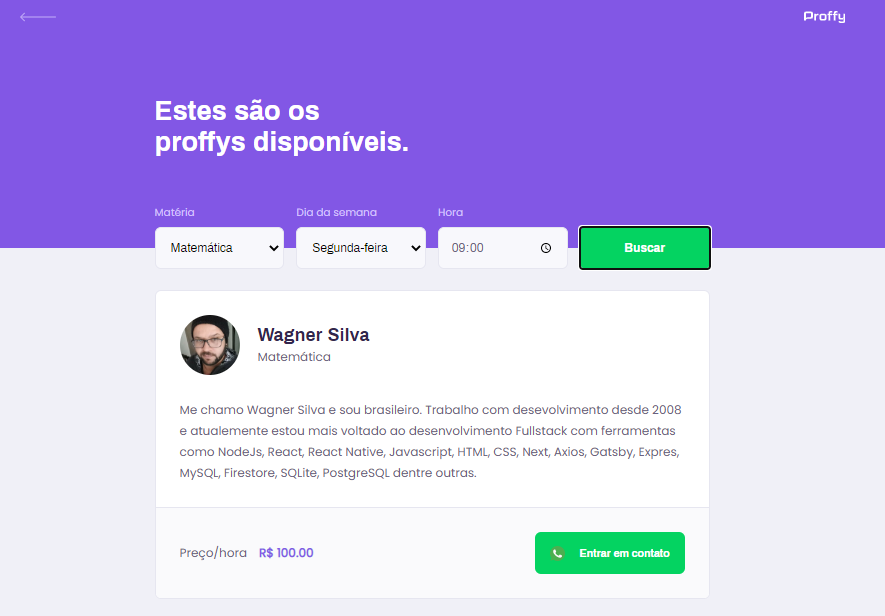
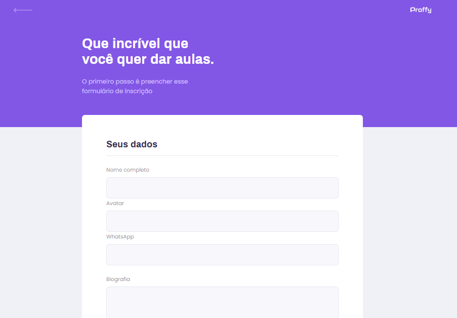
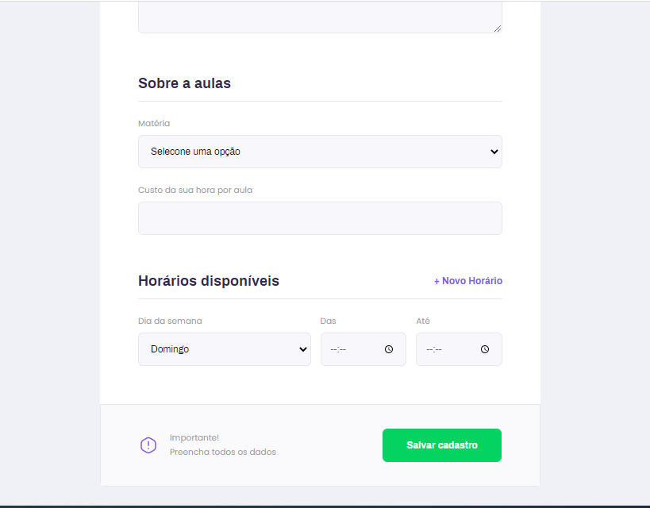
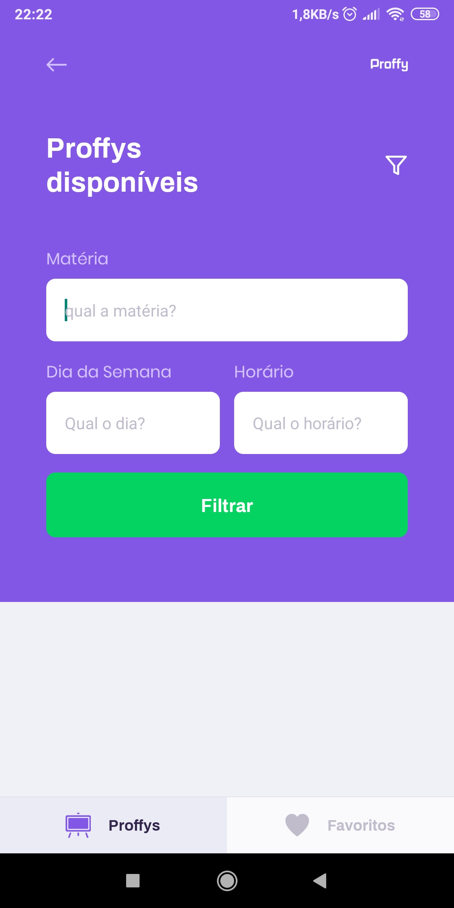

<p align="center">
   
</p>

<p align="center">	
   <a href="https://www.linkedin.com/in/wagnerjps/">
      
   </a>
   
  

  <a aria-label="Completed" href="https://nextlevelweek.com/episodios/omnistack/edicao/2">
    </img>
  </a>
  <a href="https://github.com/wagnerjps/proffy-wagdev/commits/master">
    
  </a> 

  <a href="https://github.com/wagnerjps/proffy-wagdev/blob/master/LICENSE.md">
    
  </a>
  
  <a href="https://github.com/wagnerjps/proffy-wagdev">
    
  </a>
</p>

> :rocket: Projeto feito para conectar professores e estudantes, feito na Next Level Week #2 @Rocketseat

<div align="center">
  <sub>O projeto NLW #2. Desenvolvido por by
    <a href="https://github.com/wagnerjps">Wagner Silva</a>.
    </a>
  </sub>
</div>

# 📌 Tabela de Conteúdo

* [Site de Demostração](#earth_americas-site-de-demostração) 
* [Tecnologias](#computer-tecnologias)
* [Funcionalidades](#rocket-funcionalidades)
* [Como rodar](#hammer-como-rodar)
* [Encontrou um bug? Ou está faltando uma feature?](#bug-problemas)
* [Licencia](#closed_book-licencia)

### 📺 Web Screenshot
<div style="display: flex; flex-direction: 'row'; align-items: 'center';">
   
   
</div>
<div style="display: flex; flex-direction: 'row'; align-items: 'center'; margin-top: 4px;">
   
   
</div>

### Mobile Screenshot
<div style="display: flex; flex-direction: 'row';">
   
   
   
   
   
</div>

# :earth_americas: Site de Demostração
Você pode acessar o site em:     
👉  demo: https://proffy-wagdev.vercel.app/ e testas suas funcionalidades.
     

# :computer: Tecnologias
Esse projeto foi feito utilizando as seguintes tecnologias:

* [React](https://reactjs.org/)      
* [Expo](https://expo.io/)       
* [Express](https://expressjs.com/) 
* [Knex](http://knexjs.org/) 
* [Typescript](https://www.typescriptlang.org/) 

# :rocket: Funcionalidades

* Site para cadastro de estudante e professores.
* App para conectar estudantes e professores.

# :hammer: Como rodar
```bash
# Clone o Repositório

$ git clone https://github.com/wagnerjps/proffy-wagdev.git
```
### 📦 Rode a API

```bash
# Vá para a pasta do servidor
$ cd Proffy/server

# Instale as depedencias
$ yarn install ou npm install

# Rode a aplicação
$ yarn start ou npm run start
```
Acesse a API: http://localhost:3333/

### 💻 Rode o Project Web

```bash
# Vá para a pasta web
$ cd Proffy/web

# Instale as depedencias
$ yarn install ou npm install

# Rode a aplicação
$ yarn start ou npm run start
```

Acesse: http://localhost:3333/ para testar a api.
Acesse: http://localhost:3000/ para ver o resultado.

### 📱 Run Mobile Project
Para rodar o projeto mobile você precisa de um celular com o [expo](https://play.google.com/store/apps/details?id=host.exp.exponent) instlado ou um emulador android/ios.

```bash
# Vá para a pasta mobile
$ cd Proffy/mobile

# Instale as depedencias
$ yarn install ou npm install

# Rode a aplicação
$ yarn start ou npm run start
```
Depois leia o QRCode com o app do [expo](https://play.google.com/store/apps/details?id=host.exp.exponent) ou rode em um emulador.


# :bug: Problemas

Fique a vontade **para criar uma nova issue** com o respectivo titulo e descrição na página de issues do [Proffy](https://github.com/wagnerjps/Proffy/issues) Repositorio. Se você já encontrou a solução para o problema, **Eu amaria fazer o review do seu pull request**!


# :closed_book: Licencia

Lançado em 2020 :closed_book: Licencia

Desenvolvido por [Wagner Silva](https://github.com/wagnerjps) 🚀.
Esse projeto esta sobre <a href="https://github.com/wagnerjps/proffy-wagdev/blob/master/LICENSE.md">
    
  </a>.

Dê uma ⭐️ se esse projeto te ajudou!